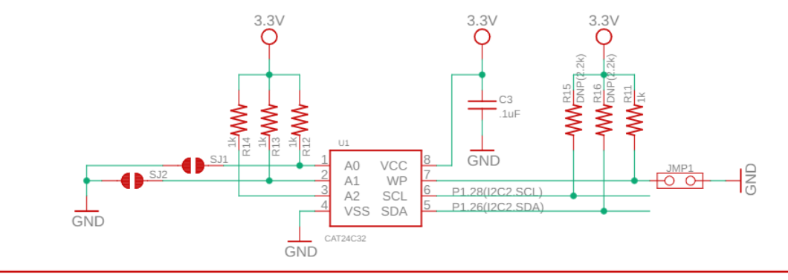

## BeagleBoard-Workshop-Examples

This git was created in order to capture Beagle Bone Black (BBB) as well as Pocket Beagle (PB)
Embedded Linux Lecture: Linux/C/GIT.

Most of the parts of this repo are the same for BBB and PB platforms.

The obvious differences between BBB and PB platforms are .dtb and .dtbo files.

For BBB platform there is an am335x-boneblack.dtb to be used.

For PB platform there is an am335x-pocketbeagle.dtb to be used.

The distro represented in the Linux embedded BBB/PB course is Debian Buster.

It is rather loose recommendation/heuristic than deterministic approach/method.

### PB (Pocket Beagle) MikroBUS configuration

The platform on the picture runs Debian Buster Linux distro (from SDcard).

The USB cable on the picture is ONLY one, used for Power Supply (powering from the notebook's
USB port), as well as console (UART to USB) cable (very powerful, isn't it?).

The ETH click attached to the PocketBeagle Techlab Cape is SPI to ETH, for the www network.

#### Latest PB kernel used from rcn (RobertCNelson's) repositories:

	uname_r=5.9.16-bone25

#### Tested/working PB kernels (by the author of this repo) from rcn (RobertCNelson's) repositories:

	uname_r=5.8.18-bone24
	uname_r=5.9.16-bone25

#### The defconfig file used from RobertCNelson's repositories
https://github.com/RobertCNelson/linux-stable-rcn-ee/commit/9ece52245bdc494f3c27ac1fa32d8589300e1b7f

	rcn-ee_defconfig

### MikroBUS V2 configuration

The mikrobusv2 branch is defined here:

https://github.com/ZoranStojsavljevic/mikrobus/tree/mikrobusv2

To run mikrobusv2 branch OOT (Out Of the kernel Tree), the following setting must be done to the
original rcn-ee_defconfig:

	$ cat rcn-ee_defconfig | grep MIKROBUS=
	CONFIG_MIKROBUS=m

[EXPERIMENTAL] Pocket Beagle MikroBUS click automatic detection

For the PB automatic detection, the following must be done:

#### [1] Shorten flash's WP pin to GND (JMP1 to shorten WP to the GND)

This image is part of the the Pocket Beagle TechLab Cape schematic.

#### [2] Configure /boot/uEnv.txt with the correct MikroBUS bus overlay

Please, do note that flash uses i2c-1 @ 0x57 (PB-MIKROBUS-0 uses i2c-2)!

	root@arm:~# ls -al /proc/device-tree/chosen/overlays/
	total 0
	drwxr-xr-x 2 root root  0 Dec  4 12:25 .
	drwxr-xr-x 3 root root  0 Dec  4 12:25 ..
	-r--r--r-- 1 root root  9 Dec  4 12:25 name
	-r--r--r-- 1 root root 25 Dec  4 12:25 PB-MIKROBUS-0
	root@arm:~#

#### [3] MikroBUS driver must be loaded at the kernel booting time

For built-in MikroBUS driver into rcn tested kernels, this is a mandatory requirement.

The .config file MikroBUS configuration:

	$ cat .config | grep MIKROBUS=
	CONFIG_MIKROBUS=y

For Out-Of-Tree (OOT) MikroBUS driver, the following entities must be added to the file /etc/modules :

	mikrobus

The .config file MikroBUS configuration:

	$ cat .config | grep MIKROBUS=
	CONFIG_MIKROBUS=m

Current Out-Of-Tree MikroBUS driver: https://github.com/ZoranStojsavljevic/mikrobus/tree/mikrobusv2

#### [4] Flash programming (with WP connected to the GND) must be done

	echo 24c32 0x57 > /sys/bus/i2c/devices/i2c-2/new_device
	./manifesto -i manifests/ETH-CLICK.mnfs -o /sys/bus/nvmem/devices/2-00570/nvmem
	echo 0x57 > /sys/bus/i2c/devices/i2c-2/delete_device

NOTE: the programming i2c used for flash is i2c-1, i2c used on the MikroBUS is i2c-2.

Please, do note that this is the test/experimental manifest, which used ONLY single ETH-CLICK
manifest programmed in it!

The content of the flash after programming:

	00000000  80 00 00 01 08 00 01 00  01 02 00 00 18 00 02 00  |................|
	00000010  10 01 4d 69 6b 72 6f 45  6c 65 6b 74 72 6f 6e 69  |..MikroElektroni|
	00000020  6b 61 00 00 10 00 02 00  09 02 45 54 48 20 43 6c  |ka........ETH Cl|
	00000030  69 63 6b 00 10 00 05 00  04 01 07 07 06 06 05 05  |ick.............|
	00000040  05 05 02 01 08 00 03 00  01 0a 00 00 08 00 04 00  |................|
	00000050  01 00 01 02 08 00 04 00  02 00 01 0b 14 00 07 00  |................|
	00000060  01 03 0b 00 00 24 f4 00  01 02 00 00 00 00 00 00  |.....$..........|
	00000070  10 00 02 00 08 03 65 6e  63 32 38 6a 36 30 00 00  |......enc28j60..|
	00000080  00 00 00 00 00 00 00 00  00 00 00 00 00 00 00 00  |................|
	*
	00000200  ff ff ff ff ff ff ff ff  ff ff ff ff ff ff ff ff  |................|

For the real one, hundreds of clicks' manifests must be at one time programmed into flash.

Please, consult the following page for that: https://github.com/vaishnav98/manifesto/blob/mikrobusv3/install.sh

Please, after all these operations are done on the target (Pocket Beagle), $sudo reboot
command must be issued!

### MikroBUS V3 configuration

The mikrobusv3 branch is defined here:

https://github.com/ZoranStojsavljevic/mikrobus/tree/mikrobusv3

To run mikrobusv3 branch Out Of the kernel Tree (OOT), the following setting must be done to the
original rcn-ee_defconfig:

	$ cat rcn-ee_defconfig | grep MIKROBUS=
	CONFIG_MIKROBUS=m

	$ cat rcn-ee_defconfig | grep grep CONFIG_W1=
	CONFIG_W1=m

	$ cat rcn-ee_defconfig | grep CONFIG_W1_MASTER_GPIO=
	CONFIG_W1_MASTER_GPIO=m

[EXPERIMENTAL] Pocket Beagle (PB) MikroBUS click automatic detection

For the PB automatic detection, the following must be done:

#### [1] Configure /boot/uEnv.txt with the correct MikroBUS bus overlay

Please, do note that for mikrobus3 PB-MIKROBUS-0 uses original i2c-1!

	root@arm:~# ls -al /proc/device-tree/chosen/overlays/
	total 0
	drwxr-xr-x 2 root root  0 Dec  4 12:25 .
	drwxr-xr-x 3 root root  0 Dec  4 12:25 ..
	-r--r--r-- 1 root root  9 Dec  4 12:25 name
	-r--r--r-- 1 root root 25 Dec  4 12:25 PB-MIKROBUS-0
	root@arm:~#

#### [2] MikroBUS driver must be loaded at the kernel booting time

For built-in MikroBUS driver into rcn tested kernels, this is a mandatory requirement.

The .config file MikroBUS configuration:

	$ cat .config | grep MIKROBUS=
	CONFIG_MIKROBUS=y

	$ cat .config | grep grep CONFIG_W1=
	CONFIG_W1=y

	$ cat .config | grep CONFIG_W1_MASTER_GPIO=
	CONFIG_W1_MASTER_GPIO=y

For Out-Of-Tree MikroBUS driver, the following entities must be added to the file /etc/modules :

	w1-gpio
	mikrobus
	mikrobus_id

The .config file MikroBUS configuration:

	$ cat .config | grep MIKROBUS=
	CONFIG_MIKROBUS=m

	$ cat .config | grep grep CONFIG_W1=
	CONFIG_W1=m

	$ cat .config | grep CONFIG_W1_MASTER_GPIO=
	CONFIG_W1_MASTER_GPIO=m

Current Out-Of-Tree MikroBUS driver: https://github.com/ZoranStojsavljevic/mikrobus/tree/mikrobusv3

Please, after all these operations are done on the target (Pocket Beagle), $sudo reboot
command must be issued!

#### --- Happy MikroBUS clicks discovery! ---
